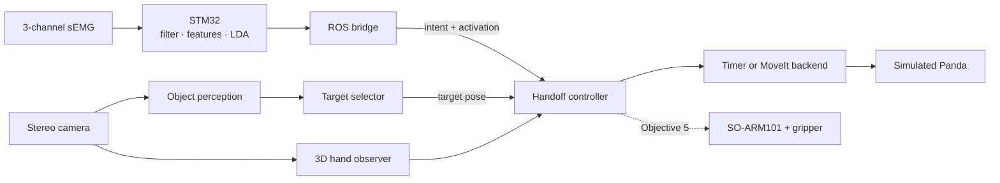

# Biosignal-Driven Shared-Autonomy Assistive Manipulation

A ROS 2 workspace and STM32 firmware for steering an assistive robot arm from
three channels of surface EMG. The arm plans and executes; the wearer supplies
a few bits per second of intent — three discrete commands and a proportional
view-steering channel — and the boundary between them is where the work is.

Everything claimed below was measured, and the recordings it was measured from
are in `datasets/`. Where a result was withdrawn after measurement, the logs
say so.

For the package boundaries, ROS interfaces, state machine, and safety gates,
start with the [system design](docs/system_design.md).

## What runs today

| | |
| --- | --- |
| Discrete intent on the MCU | `REST` / `NEXT_TARGET` / `CONFIRM` / `ABORT` at 20 Hz, filter → features → Q18 LDA → activation threshold → event gate, entirely on an STM32F103C8T6 (40% flash, 58% RAM) |
| Proportional view control | wrist extension and ulnar deviation steer one bounded axis; contraction strength selects **rate** |
| Perception | ArUco baseline, and markerless instance segmentation with passive-stereo metric localization |
| Handoff | state machine with bounded active-view search, stale-input gating, and global `ABORT` |
| Arm motion | MoveIt on a simulated Panda, or a timer backend for tests; goal construction shared with the Objective 1 reaching path |

### Architecture



See the [system design](docs/system_design.md) for topic contracts, gates,
formulas, and the full state machine.

The hardware-free integration launch uses synthetic object and hand inputs and
the timer motion backend. The same handoff controller's MoveIt backend has been
runtime-verified separately on the simulated Panda. Real-arm validation on an
SO-ARM101 is the next objective and has not started.

## The band


Three gelled electrode modules on one strap, 120 degrees apart, about 5 cm
below the elbow. Positions are given for a right forearm resting palm down:
**ch0** palmar, over the flexors; **ch1** on the radial (thumb) side; **ch2**
on the ulnar side.

Two things about that placement were measured rather than chosen. It has to sit
over the muscle bellies: one position closer to the wrist stayed weak through
several re-applications, and swapping the two straps' positions showed the
weakness stayed with the spot rather than the hardware -- it was over tendon.
And ch1 is the weakest of the three on purpose. Two well-separated channels and
a mediocre one were enough to start, and whether the third is worth more effort
is a question classification accuracy can answer where further fiddling cannot.

Each module reaches its column on the carrier board on four pins -- `DO`, `AI`,
`VCC`, `GND` -- so the three share the board's circuit ground. Whether each
module also carries its own skin-side reference electrode is not established
here: the vendor schematic covers the carrier, not the sensor modules.

Electrode placement is one of the donning variables the cross-donning numbers
below are about. The others are contact quality, which decays on a timescale
shorter than a working day and takes every calibrated constant with it, and gel
condition. None of them is controlled by anything in software.

## Measured, on a wearer

From the
[closed-loop session of 2026-08-28](docs/objective35_classifier_log.md):

- Contraction strength selects speed to within **1% of ideal** in four of five
  activation bands.
- **2.4%** of motion went against the gesture that commanded it.
- **Zero** false triggers and **zero** dropped packets in ten minutes of
  ordinary activity — typing, a cup, a phone, posture changes.
- Cross-donning classification, holding out one electrode application at a
  time: **93.3–95.1%** window accuracy over five donnings.
- A published intent reaches the state it causes in **2.4 ms** (median of 40
  cycles). The wearer feels that plus two parts measured separately: the event
  gate's 650 ms for `ABORT`, and a 26 ms median serial receipt. So an `ABORT`
  arrives in about **680 ms**, of which the gate is 96%.

## What does not work

Stated here rather than in a footnote, because both are properties of the
result and not open bugs.

- **Light contractions do not register at all.** The usable range starts at
  moderate effort. This is not the activation threshold: of the
  direction-gesture windows below it, 0 of 21 are recognised as the gesture,
  so lowering it admits windows the classifier calls rest. The minimum speed
  is set by `target_search_nominal_speed`, not by the threshold.
- **One subject, five donnings, three of them within two days.** The
  cross-donning numbers above do not carry to another wearer, and adding a
  fifth donning improved internal folds while *degrading* transfer to
  recordings from a fortnight earlier.

## Running the whole chain without hardware

```bash
ros2 launch assistive_handoff integrated_simulation.launch.py
# in another terminal, the wearer's inputs:
ros2 run assistive_handoff sim_intent_publisher      # n / c / a
```

Add `appears_after_sec:=8.0` to hold the object back and exercise the search
path: the controller sweeps, stops itself when the observation arrives, locks
on a second one after the stop, and one CONFIRM takes it to APPROACH.

This launch intentionally uses the timer backend and does not start MoveIt.
The verified Panda path is separate: with the MoveIt stack and a target source
already running, start one handoff controller with:

```bash
ros2 run assistive_handoff handoff_controller --ros-args \
  -p motion_backend:=moveit
```

Do not start this controller beside `integrated_simulation.launch.py`, because
that launch already starts its own timer-backed controller.

## Layout

```
src/          ROS 2 packages: perception, handoff state machine, EMG bridge,
              and the MoveIt goal construction they share
firmware/     STM32 firmware, host tools, and the wire protocol
datasets/     every recording the numbers above come from
docs/         design, the citation ledger, the evaluations, and the logs of
              how each result was reached
```

Start with the [system design](docs/system_design.md) for the architecture, and
the [Objective 3.5 classifier log](docs/objective35_classifier_log.md) for how
the EMG side actually behaves. The log records what failed and why, which is
more useful than the summary alone.

## Build and test

```bash
source /opt/ros/jazzy/setup.bash
colcon build --symlink-install
source install/setup.bash

python3 -m pytest src/                  # ROS packages
python3 -m pytest firmware/tools -q     # host tools and protocol mirrors
make -C firmware/test check              # C unit tests and golden vectors
```

`make check` regenerates the golden fixtures the host tools compare against.
They are not committed on purpose: a committed fixture lets the Python mirror
pass against bytes some earlier C produced.

## Running a session

The board must be flashed first; the
[firmware README](firmware/README.md) covers the hardware.
Then, in order:

```bash
# 1. Calibrate this donning. Refuses to send a calibration it does not trust,
#    and reports what the deployed model calls each gesture's own trials.
python3 firmware/tools/emg_calibrate.py --port /dev/ttyACM0

# 2. Bridge the board onto ROS topics, with that calibration
ros2 run emg_intent_bridge emg_intent_bridge --ros-args \
  -p port:=/dev/ttyACM0 -p calibration_file:=datasets/emg_calibration/<file>.json

# 3. The handoff controller, with proportional steering enabled
ros2 run assistive_handoff handoff_controller --ros-args \
  -p proportional_search_available:=true
```

Read the calibration's own verdict before trusting a session. A donning can
pass its separation check and still be unusable — the classification report it
prints is what tells you, in ninety seconds rather than after a wasted run.

## Collecting training data

```bash
python3 firmware/tools/emg_guided_capture.py --donning A6
python3 firmware/tools/emg_train_lda.py datasets/emg --require-donning \
  --c-output firmware/src/emg_classifier_model.h
```

`--donning` is required, and folds are held out by donning rather than by
session. Holding out a session returns its own electrode application to the
training set, and the accuracy that comes out measures repeatability rather
than transfer — a model accepted that way identified `NEXT_TARGET` on 2% of
windows on one held-out donning.

## Status and plans

The [system design](docs/system_design.md) carries the architecture and current
per-component status. Citations are tracked in the
[literature ledger](docs/literature_ledger.md), which records for each source
the smallest claim it supports and what it does *not* establish for this
project -- including, for the one paper closest to this work, that none of its
method is used here.

The roadmap and schedule are not published; they are a personal plan rather
than part of the system.

## License

Apache-2.0; see `LICENSE`. The recordings under `datasets/` are covered by the
same terms -- they are from one subject, the author, and are published so the
numbers above can be checked rather than taken on trust. `NOTICE` lists the
vendored STMicroelectronics driver and USB code, which stays under its own
BSD-3-Clause and Apache-2.0 terms.
