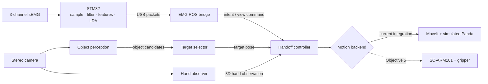
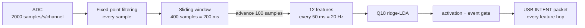
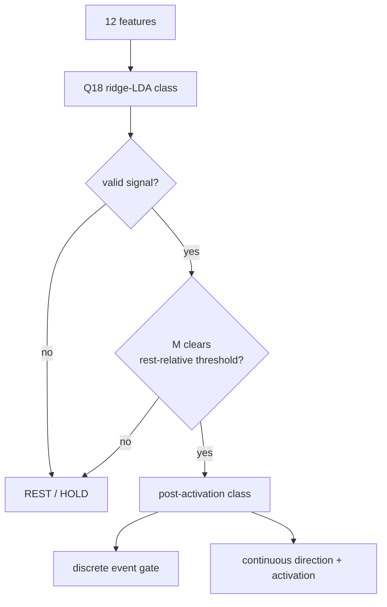
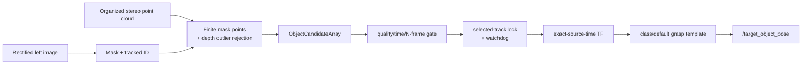
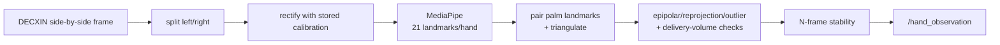
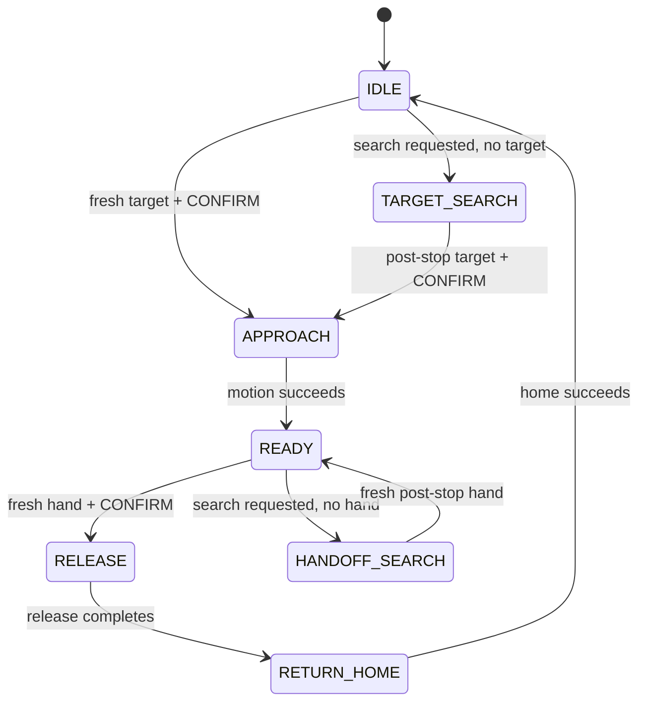
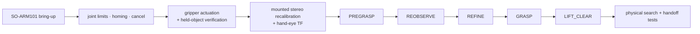

# System Design

> Current through 2026-08-29. This document separates verified software,
> bounded bench evidence, simulated execution, and future real-arm work.

## 1. System at a glance

### Status

| Scope | Status | Boundary |
| --- | --- | --- |
| Objectives 1, 2, 3.1 | Complete | Panda simulation: MoveIt reaching and ArUco baseline |
| Objective 3.2 | Complete | COCO object masks + stereo localization; bounded bench checks |
| Objective 3.5 | **Complete (2026-08-28)** | STM32 inference, ROS bridge, calibrated proportional control |
| Objectives 4.1, 4.3 | Complete | Simulated handoff and bounded active-view search |
| Objective 4.2 | Complete for fixed-bench scope | Moving-camera extrinsic belongs to Objective 5 |
| Interface integration | Complete (2026-08-29) | Full ROS chain reaches the real MoveIt planner on simulated Panda |
| Objective 5 | **Next** | SO-ARM101, gripper, mounted stereo, real grasp/handoff |

### End-to-end architecture



| Component | Decides | Does **not** decide |
| --- | --- | --- |
| STM32 | Gesture class, event, direction, normalized effort | Robot pose or velocity |
| Vision | Object/hand observation and quality | Whether motion is allowed |
| Target selector | Which stable object pose is active | Robot execution |
| Handoff controller | State, guards, search rate, motion request | Perception results |
| MoveIt/backend | Feasible trajectory and execution result | User intent or handoff policy |

## 2. Packages and ROS contracts

### Package map

| Layer | Packages |
| --- | --- |
| Messages and intent | `assistive_interfaces`, `emg_intent_bridge`, `firmware/` |
| Object perception | `markerless_object_perception`, `marker_pose_provider`, `target_selector` |
| Hand perception | `stereo_hand_observer` |
| Decision and search | `assistive_handoff` |
| Motion | `assistive_motion`, `object1_demo` |

ROS packages live under `src/`. `firmware/` targets the STM32 and therefore
uses `COLCON_IGNORE`.

### Main topics

| Topic | Type | Producer → consumer | Contract |
| --- | --- | --- | --- |
| `/assistive_intent` | `AssistiveIntent` | bridge → selector/controller | One `NEXT_TARGET`, `CONFIRM`, or `ABORT` event |
| `/assistive_view_control` | `ViewControlCommand` | bridge → controller | `LEFT/RIGHT/HOLD` + activation + quality |
| `/object_candidates` | `ObjectCandidateArray` | perception → selector | Candidates from one source-stamped stereo frame |
| `/target_object_pose` | `PoseStamped` | one pose provider → controller | Latest selected grasp target in planning frame |
| `/hand_observation` | `HandObservation` | hand observer → controller | Valid/invalid source-stamped 3D hand cue |
| `/handoff_search_sweeping` | `Bool` | controller → selector | Search gesture is steering, not target cycling |
| `/handoff_state` | `String` | controller → diagnostics | Public state |
| `/simulated_view_angle` | `Float64` | controller → diagnostics | Current simulated search-axis angle |

```text
Live streams: intent, view command, candidates, hand observation → VOLATILE
Retained state: /target_object_pose → reliable + transient-local + depth 1
Freshness: source timestamp, not callback receipt time
Ordering: wrap-safe sequence number
Pose source: fixed / ArUco / markerless — configure exactly one at a time
```

## 3. EMG: samples to proportional motion

### 3.1 Timing and windows



| Quantity | Value | Meaning |
| --- | ---: | --- |
| Sample period | `1 / 2000 = 0.5 ms` | Spacing between raw ADC frames |
| Window | `400 samples = 200 ms` | History used for one feature vector |
| Hop | `100 samples = 50 ms` | New data before the next result |
| Overlap | `300 / 400 = 75%` | Consecutive windows share history |
| Output cadence | `20 Hz` | One decision/activation every 50 ms |

There is no raw-signal downsampling before feature extraction. “100 samples”
is the hop between overlapping 400-sample windows, not a replacement of 100
raw points by one point.

For channel `c` and window length `N = 400`:

```text
MAV_c = (1/N) Σ |x_c[i]|
RMS_c = √((1/N) Σ x_c[i]²)
WL_c  = Σ |x_c[i] - x_c[i-1]|
ZC_c  = thresholded zero-crossing count
```

Three channels × four features = **12 classifier inputs**. Effort uses:

```text
M = MAV_0 + MAV_1 + MAV_2
```

The three filtered signals are not added first; each channel gets its own MAV,
then the three non-negative amplitudes are summed.

### 3.2 Decision path



- The event gate emits one `NEXT_TARGET`, `CONFIRM`, or `ABORT` per accepted
  gesture; it does not publish that event every 50 ms.
- The view stream publishes direction and effort every feature hop.
- `ABORT` has global priority. `ULNAR` is direction-only and never enters the
  discrete event gate.

### 3.3 Adaptive rest baseline

Only windows originally classified as `REST` update the baseline:

```text
first REST:  b₀ = M_rest

later REST:  bₖ = bₖ₋₁ + (M_rest - bₖ₋₁) / 2^shift

threshold:   T = max(K · b, T_floor)
```

Current `shift = 4`, so each REST update moves `1/16` of the remaining gap.
This follows gradual contact/noise drift while ignoring gesture windows. It is
not speed smoothing and not cross-session normalization; a new electrode
application uses per-donning calibration.

### 3.4 Calibration and activation

Calibration records repeatable, comfortable holds—not maximum voluntary
contraction. It stores separate reference levels because wrist extension and
ulnar deviation are not equally strong:

```text
LEFT  reference R_L = median(trial 90th-percentile MAV for NEXT_TARGET)
RIGHT reference R_R = median(trial 90th-percentile MAV for ULNAR)

a = clamp((M - T) / (R_direction - T), 0, 1)
```

`a = 1` means “full configured command speed for this session,” not “the
wearer's physiological maximum.” The ROS speed limit remains independent.

Example with `T = 100`, `R = 300`:

| Current total MAV `M` | Activation `a` | Meaning |
| ---: | ---: | --- |
| `≤100` | `0%` | Rest/HOLD |
| `150` | `25%` | Quarter speed request |
| `200` | `50%` | Half speed request |
| `250` | `75%` | Three-quarter speed request |
| `≥300` | `100%` | Saturated at configured full speed |

### 3.5 MCU versus ROS

| STM32, every 50 ms | ROS controller |
| --- | --- |
| Sample/filter all three channels | Reject stale, future, duplicate, low-quality commands |
| Build 12 features | Require two consecutive same-direction commands |
| Classify with LDA | Smooth activation with `α = 0.15` |
| Adapt rest baseline and apply threshold | Convert activation to bounded angular rate |
| Emit event, direction, activation, confidence, timestamp, sequence | Apply acceleration/deceleration, angle limits, state guards, watchdog |

```text
target rate:  v* = direction · v_nominal · a_smooth

smoothing:    a_smooth[k] = 0.15·a[k] + 0.85·a_smooth[k-1]

motion tick:  20 ms (50 Hz)
watchdog:     HOLD after 0.25 s without a fresh view command
```

The STM32 never sends a robot velocity. It sends normalized human input; ROS
applies the robot-specific speed and safety limits. Current proportional motion
drives the simulated view axis. Connecting it to an SO-ARM101 joint is
Objective 5.

## 4. Perception paths

### 4.1 Object to target pose

Active markerless classes: `bottle`, `cup`, `apple`; model: official
COCO-pretrained Ultralytics instance segmentation; confidence: `0.50`.



The gate decides whether a track is stable; the lock decides which stable track
is selected. `CONFIRM` authorizes controller motion—it does not create the
observation. ArUco remains a separate regression/fallback pose source.

### 4.2 Stereo hand observation



For a rectified stereo pair:

```text
horizontal disparity:  d = x_left - x_right
depth:                 Z ≈ f · B / d
```

`f` is focal length in pixels and `B` is camera baseline in metres. Vertical
row difference is an epipolar-quality error; it is not multiplied by horizontal
disparity. A shared composite timestamp proves paired transport, not simultaneous
sensor exposure.

Any missing, stale, unsynchronized, low-confidence, invalid, or unstable hand
observation blocks release. This is a prototype handoff cue, not safety-rated
person detection.

## 5. Handoff control



### Stop-and-look search

```text
move inside configured angle band
→ observation appears
→ command HOLD
→ wait until axis stops
→ reject observations stamped before the stop
→ accept a newer stable observation
→ continue state machine
```

One search episode uses either proportional `LEFT/RIGHT` or discrete
`NEXT_TARGET` stepping, never both. `HANDOFF_SEARCH` additionally requires
`holding_object = true`.

## 6. Motion and safety boundary

### Backends

| Backend | Current use | Evidence boundary |
| --- | --- | --- |
| `simulated` | Timers and simulated view angle | Default hardware-free integration |
| `moveit` | Sends `MoveGroup` action goals to `/move_action` | Runtime-verified on simulated Panda |
| SO-ARM101/LeRobot | Planned Objective 5 backend | Not yet brought up |

`assistive_motion` builds shared MoveIt goals. The Panda result proves the ROS
action/planning path, not compatibility with SO-ARM101 joint names, limits,
kinematics, gripper, or hardware timing.

### Fail-closed rules

| Condition | Response |
| --- | --- |
| Stale/missing target | Do not approach |
| Stale/missing/invalid hand | Do not release |
| Stale view stream | Hold search axis |
| Direction reversal | Decelerate/stop before reversing |
| Search bound reached | Clamp position |
| Observation during search motion | Stop; require newer post-stop observation |
| `ABORT` | Preempt normal work and return home |
| Planning/execution failure | Do not report success; attempt return home |
| Return-home failure | Latch fault and reject new work |

These software guards do not replace an emergency stop, collision sensing,
torque/current limits, risk assessment, or supervised hardware validation.

## 7. Verified evidence

| Area | Result | Limit |
| --- | --- | --- |
| EMG acquisition | 2000 Hz; zero lost/malformed/duplicated packets in reported 15 s capture | One board/setup |
| EMG classifier | 93.3–95.1% leave-one-donning-out window accuracy | One wearer; light contractions not recognized |
| Proportional control | 4/5 activation bands within 1% of ideal; 2.4% motion against gesture | Bench/simulated search axis |
| Ordinary activity | Zero false triggers and zero dropped packets in 10 min | Tested wearer/activities only |
| Intent-to-state software | 2.4 ms median, 3.2 ms p95, 3.6 ms max over 40 cycles | Excludes EMG decision and serial delay |
| Markerless stereo | 150/150 valid frames at 10 Hz; bottle `Z=0.275 m` vs tape `0.27–0.28 m` | Bounded bench checks, not full error curve |
| Stereo hand | Calibration, MediaPipe, triangulation and gates verified | Fixed bench; no moving-link extrinsic |
| Integrated motion | `CONFIRM` drove `IDLE → APPROACH`; MoveIt succeeded and state reached `READY` | Simulated Panda, not physical grasp |

Detailed measurements and failed approaches remain in the objective logs;
this table keeps only the accepted result and its boundary.

## 8. Next boundary: Objective 5



Objective 5 also adds tabletop filtering, class-specific grasp offsets, abort
behavior on hardware, and measured failure recovery. Fix calibration bias
before learning residual corrections.

MuJoCo and ACT/LeRobot experiments remain conditional Phase-3 research after a
measured deterministic real-arm baseline. Language/voice selection, EOG,
open-ended VLA grounding, Isaac Lab reinforcement learning, and a repository-
wide C++ rewrite remain outside current scope.

## 9. References and runbooks

- [`README.md`](../README.md): build, launch, and repository entry points.
- [`firmware/README.md`](../firmware/README.md): hardware and firmware status.
- [`firmware/PROTOCOL.md`](../firmware/PROTOCOL.md): USB packet contracts.
- [`objective35_classifier_log.md`](objective35_classifier_log.md): EMG evidence and corrections.
- [`literature_ledger.md`](literature_ledger.md): adopted claims and evidence limits.

The EMG feature family follows established time-domain practice; the classifier,
fixed-point deployment, rest gate, per-donning calibration, controller guards,
and measured acceptance boundaries are project implementations.
