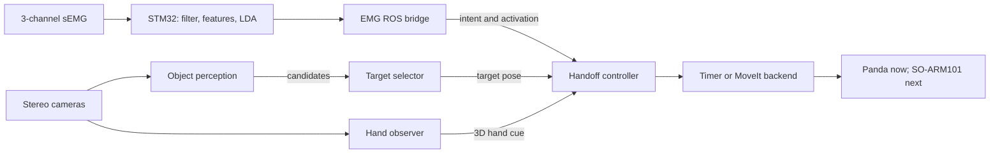

# System Design

This workspace is an assistive-manipulation prototype. A wearer provides a
small amount of intent through three surface-EMG channels; perception finds the
object and receiving hand; the controller decides when motion is allowed; and
MoveIt plans and executes arm motion.

The jobs stay separate on purpose. EMG never invents a robot pose, vision never
commands a motor, and MoveIt never decides whether a handoff should begin.

## 1. Current system

The ROS chain runs end to end with simulated inputs. The STM32 and ROS bridge
are also verified as the real intent source for the same interfaces:

1. STM32 firmware classifies discrete EMG intent and contraction strength.
2. A ROS bridge publishes intent and proportional view commands.
3. Stereo perception publishes stable object and hand observations.
4. A selector locks one object and publishes its pose.
5. The handoff controller checks freshness, confidence, state, and safety
   conditions.
6. The controller uses timers for tests or sends goals to the Panda MoveIt
   stack.

Objectives 1, 2, 3.1, 3.2, 3.5, 4.1, 4.2, and 4.3 are complete within their
documented bench or simulation scope. Objective 5 is next: replace the Panda
simulation with the SO-ARM101, mount and recalibrate the stereo pair, control
the real gripper, and verify physical grasp and handoff.

## 2. Architecture



The three main data paths are:

- **Object:** image → segmented object → stable track → target pose.
- **Hand:** stereo images → MediaPipe keypoints → stable 3D hand point.
- **Intent:** EMG samples → intent/direction → guarded state change or bounded
  search motion.

The handoff controller is where these paths meet.

## 3. Workspace map

| Location | Responsibility |
| --- | --- |
| `src/assistive_interfaces` | Custom ROS messages shared by independent packages. |
| `src/emg_intent_bridge` | Converts the STM32 USB protocol into ROS topics. |
| `src/marker_pose_provider` | Preserved ArUco pose baseline. |
| `src/markerless_object_perception` | Segments/tracks objects and estimates stereo 3D positions. |
| `src/target_selector` | Stabilizes candidates, locks one target, transforms it, and publishes its pose. |
| `src/stereo_hand_observer` | Rectifies stereo images, detects hand keypoints, triangulates them, and applies quality gates. |
| `src/assistive_handoff` | Owns the state machine, active-view search, simulators, and integrated launch. |
| `src/assistive_motion` | Builds MoveIt goals shared by the handoff and Objective 1 paths. |
| `src/object1_demo` | Fixed-pose and MoveIt reaching regression path. |
| `firmware` | STM32 acquisition, DSP/classification, USB protocol, host tools, and tests. |
| `datasets` | Recordings supporting the reported measurements. |

ROS packages stay under `src/`. Firmware stays outside it and carries
`COLCON_IGNORE` because it targets the microcontroller rather than `colcon`.

## 4. ROS interfaces

Custom messages live in
[`assistive_interfaces/msg`](../src/assistive_interfaces/msg). They are needed
because standard messages do not include fields such as EMG confidence,
sequence number, stereo skew, or localization confidence.

| Topic | Type | Producer → consumer | Meaning |
| --- | --- | --- | --- |
| `/assistive_intent` | `AssistiveIntent` | EMG bridge/simulator → selector and controller | One `NEXT_TARGET`, `CONFIRM`, or `ABORT` event. `REST` is not published. |
| `/assistive_view_control` | `ViewControlCommand` | EMG bridge/simulator → controller | `LEFT`, `RIGHT`, or `HOLD`, with activation and signal quality. |
| `/object_candidates` | `ObjectCandidateArray` | markerless perception → selector | Objects in one timestamped stereo observation. |
| `/target_object_pose` | `PoseStamped` | active pose provider → controller/reaching node | Selected object's grasp target in the planning frame. |
| `/hand_observation` | `HandObservation` | stereo hand observer/simulator → controller | Valid/invalid 3D hand cue with quality fields. |
| `/handoff_search_sweeping` | `Bool` | controller → selector | Gestures currently mean search direction, not target cycling. |
| `/handoff_state` | `String` | controller → diagnostics | Current public state. |
| `/simulated_view_angle` | `Float64` | controller → diagnostics | Simulated search-axis position. |

Interface rules:

- Intent, view commands, candidates, and hand observations are live streams;
  old commands must not be replayed.
- `/target_object_pose` is reliable and transient-local with depth 1. A
  late-starting consumer receives the latest pose, but the controller still
  rejects it when its **source timestamp** is too old.
- Sequence numbers reject duplicate and out-of-order commands.
- Timestamps describe when sensing or intent happened, not receipt time.
- Only one configured provider publishes `/target_object_pose` at a time.
  Fixed-pose, ArUco, and markerless providers are alternatives.

## 5. EMG path

The STM32 reads three analog channels at 2000 Hz:

```text
ADC/DMA samples
  → fixed-point filtering
  → 200 ms windows, updated every 50 ms
  → MAV, RMS, waveform length, and zero crossings per channel
  → Q18 ridge-LDA scores
  → rest-relative activation check
  → event gate
  → USB INTENT packets at 20 Hz
```

Filtering and classification run on the MCU; raw samples can continue
streaming for diagnosis. The classifier distinguishes `REST`, `NEXT_TARGET`,
`CONFIRM`, `ABORT`, and direction-only `ULNAR`. LDA suits the small feature
vector and measured separation; a larger model has not been shown to solve a
measured problem.

The feature family follows established time-domain EMG work by Hudgins et al.
The classifier, fixed-point deployment, gates, and calibration policy are
project implementations. See [`literature_ledger.md`](literature_ledger.md)
and [`references.bib`](../references.bib).

Discrete and continuous outputs have different jobs:

- `NEXT_TARGET`, `CONFIRM`, and `ABORT` are **events**. A stable gesture emits
  one command; it is not repeated every 50 ms.
- Search is **continuous**. Direction is categorical, while contraction
  strength controls speed.

For one calibrated direction:

```text
activation = clamp(
    (current_MAV_sum - activation_threshold)
    / (comfortable_direction_MAV - activation_threshold),
    0, 1
)

speed = direction_sign × nominal_speed × activation
```

This is **proportional rate control**: more effort means faster movement in the
same direction; less effort slows it; releasing enters `HOLD`.

Normalizing each gesture against a reference measured for that gesture is
class-specific normalization, published by Scheme et al. in *IEEE TNSRE* 22(1),
2014. Here the references come from a separate per-donning calibration rather
than from the classifier's training data; none of the idea is new.

An earlier absolute-position mapping was rejected after a real session showed
that 8 of 44 pushes could move against their own gesture. A rate does not name
an angle, so the controller owns the safe angle band and clamps every update.

View commands are accepted only during `TARGET_SEARCH` or `HANDOFF_SEARCH`.
The controller checks timestamp and sequence freshness, confidence, signal
quality, activation, deadband, consecutive-command stability, smoothing,
acceleration/deceleration, angle bounds, and a stale-command watchdog.
`HANDOFF_SEARCH` also requires `holding_object=true`. `ABORT` bypasses
smoothing and has global priority, but is not a certified emergency stop.

## 6. Object path

The active markerless classes are `bottle`, `cup`, and `apple`. Perception uses
an official COCO-pretrained Ultralytics instance-segmentation model with a 0.50
confidence threshold; custom training is not required for the current scope.

For each tracked mask, the node reads finite points from the aligned organized
stereo cloud, rejects depth outliers, and publishes a robust 3D reference
point. This candidate is not yet a grasp pose. The ArUco path remains as a
regression and fallback.

```text
ObjectCandidateArray
  → ROS-message adapter
  → class/quality/time/N-frame stability gate
  → selected-track lock and watchdog
  → exact-source-time TF transform
  → class/default grasp template
  → /target_object_pose
```

The **gate** asks whether a candidate is trustworthy across recent frames. The
**lock** asks which trustworthy candidate is selected and whether that track
remains visible.

The pose is published on every frame in which the locked target remains
visible. `CONFIRM` does not create the observation; it authorizes the handoff
controller to act on a fresh one. This avoids a deadlock in which the controller
needs an observation to stop searching but the selector waits for confirmation
before publishing it.

`NEXT_TARGET` cycles the lock outside an active sweep. `ABORT` clears the gate
and lock. The watchdog expires a track that stops appearing.

## 7. Stereo and hand path

The DECXIN device supplies one side-by-side image over one USB connection. The
live node splits it into left and right halves, preserves one source timestamp,
rectifies both images with stored calibration, and publishes stereo products.
A shared transport timestamp proves paired arrival, not simultaneous physical
exposure.

Object localization consumes an aligned organized point cloud. Hand
localization uses projection matrices from `CameraInfo.P` and triangulates
matching keypoints. For a rectified pair:

```text
Z ≈ focal_length × stereo_baseline / horizontal_disparity
```

Larger horizontal disparity means a closer point. Vertical disagreement is an
epipolar-quality error, not part of the depth formula. Calibration files live
under the stereo package's `config/` directory.

MediaPipe produces 21 two-dimensional landmarks per detected hand. The project
keeps stable palm-root landmarks, pairs the two views, triangulates each pair,
rejects poor points and 3D outliers, then combines the survivors:

```text
composite image
  → split + rectify
  → MediaPipe landmarks in each eye
  → left/right pairing and triangulation
  → quality and delivery-volume checks
  → N-frame stability gate
  → /hand_observation
```

Missing, stale, unsynchronized, low-confidence, invalid, or unstable input
means “no usable hand” and never permits release. This is a handoff-readiness
cue, not safety-rated person detection.

## 8. Handoff state machine

The state machine is in
[`handoff_controller.py`](../src/assistive_handoff/assistive_handoff/handoff_controller.py):

```text
IDLE
  ├─ fresh target + CONFIRM ───────────────→ APPROACH
  └─ no target + search command → TARGET_SEARCH
                                      │ fresh post-stop target + CONFIRM
                                      └────────────────────────→ APPROACH

APPROACH → READY
READY
  ├─ fresh hand in delivery zone + CONFIRM → RELEASE
  └─ no hand + search command → HANDOFF_SEARCH
                                    │ fresh post-stop hand
                                    └───────────────→ READY

RELEASE → RETURN_HOME → IDLE
```

Search is stop-and-look: move inside the configured band, hold when an object
or hand appears, wait for the axis to stop, then require a newer observation
before locking. Each episode chooses proportional `LEFT`/`RIGHT` when
calibration is valid, or bounded `NEXT_TARGET` steps as fallback. They never
run concurrently. `/handoff_search_sweeping=true` prevents the selector from
treating the same gesture as target cycling during a sweep.

State-machine invariants:

- `IDLE` means the simulated gripper is empty.
- `HANDOFF_SEARCH` requires `holding_object=true`.
- A stale target cannot start `APPROACH`.
- A missing or invalid hand cannot start `RELEASE`.
- Search and motion time out instead of running forever.
- Motion failure returns home; return-home failure latches a fault.
- `ABORT` cancels active work and returns home.

Real gripper state, safe abort-release sequencing, and proof that an object was
actually grasped belong to Objective 5.

## 9. Motion backends

| Backend | Purpose | Status |
| --- | --- | --- |
| `simulated` | Timers stand in for approach, release, and return. | Default in integrated simulation. |
| `moveit` | Sends `moveit_msgs/action/MoveGroup` goals to `/move_action`. | Runtime-verified on the simulated Panda. |

[`assistive_motion/goal_builders.py`](../src/assistive_motion/assistive_motion/goal_builders.py)
contains goal construction shared by `object1_demo` and the handoff controller.
`APPROACH` uses the latest fresh target, `RELEASE` uses the fixed delivery
position, and `RETURN_HOME` uses the configured home joint goal. Rejected
goals, failures, and timeouts do not count as successful motion.

The Panda is a simulation model. Objective 5 adds an SO-ARM101/LeRobot backend
rather than pretending the robots share joint names, limits, kinematics, or
gripper behavior.

## 10. Safety and failure behavior

| Condition | Response |
| --- | --- |
| Old, future-dated, duplicate, or out-of-order command | Ignore it. |
| Missing/stale target | Do not approach; remain idle or search. |
| Missing/stale/invalid hand | Do not release. |
| Search command stops arriving | Hold the search axis. |
| Search reaches its bound | Clamp; never continue beyond it. |
| Object or hand appears during motion | Stop, then require a newer post-stop observation. |
| `ABORT` during active work | Preempt normal behavior and return home. |
| Planning or execution failure | Do not claim success; try to return home. |
| Return-home failure | Latch a fault and refuse new work. |

These prototype software rules do not replace a physical emergency stop,
collision sensing, torque limits, risk assessment, or supervised hardware
validation.

## 11. Evidence and limits

| Area | Verified result | Boundary |
| --- | --- | --- |
| EMG acquisition | 2000 Hz; zero lost/malformed/duplicated packets in the reported 15 s capture. | One board and setup. |
| EMG classifier | 93.3–95.1% leave-one-donning-out window accuracy over five donnings. | One wearer; light contractions are not recognized. |
| Proportional control | Four of five bands within 1% of ideal speed; 2.4% motion against gesture. | Bench/simulated search axis. |
| Ordinary activity | Zero false triggers and zero dropped packets in ten minutes. | Tested wearer and activities only. |
| Intent-to-state path | 2.4 ms median, 3.2 ms p95, 3.6 ms maximum over 40 cycles. | Excludes EMG decision and serial delay. |
| Wearer-facing `ABORT` estimate | About 680 ms: 650 ms gate + 26 ms median serial + 2.4 ms software. | Components measured separately. |
| Markerless stereo | 150/150 valid frames at 10 Hz; bottle Z = 0.275 m versus tape 0.27–0.28 m. | One bench cross-check. |
| Stereo hand observation | Calibration, MediaPipe, triangulation, gates, and N-frame stability verified. | Fixed bench, not safety-rated. |
| MoveIt handoff motion | One `CONFIRM` caused `IDLE → APPROACH`; Panda execution succeeded and advanced to `READY`. | Simulated Panda, not a real grasp. |

Detailed evidence lives in the objective logs, especially
[`objective35_classifier_log.md`](objective35_classifier_log.md). The table
states each result's boundary rather than turning a bounded test into a general
hardware claim.

## 12. Remaining work

Objective 5 must add and measure:

- SO-ARM101 communication, joint limits, cancellation, homing, and gripper
  commands;
- real held-object and grasp verification;
- eye-in-hand mounting, stereo recalibration, and hand-eye transform;
- deterministic `PREGRASP → REOBSERVE → REFINE → GRASP → LIFT_CLEAR` behavior;
- tabletop filtering and class-specific grasp offsets;
- bounded physical search, handoff, abort, timeout, and failure recovery.

Fix systematic calibration error before asking a learned model to correct
residuals.

MuJoCo and ACT/LeRobot experiments are conditional Phase-3 research after the
deterministic real-arm baseline. They may learn bounded residual correction or
failure recovery; they do not replace perception, intent, safety, or the state
machine.

Language/voice target selection, EOG, open-ended VLA grounding, Isaac Lab /
Isaac Sim reinforcement learning, and a repository-wide C++ rewrite are cut
from the current scope.

## 13. Related documents

- [`README.md`](../README.md): build and run commands.
- [`firmware/README.md`](../firmware/README.md): hardware, pin mapping, and the
  wire protocol.
- [`firmware/PROTOCOL.md`](../firmware/PROTOCOL.md): packet layouts.
- [`literature_ledger.md`](literature_ledger.md): claim-to-source limits.
- Objective logs: measurements, failures, and evidence behind design changes.

This document describes the current architecture and next implementation
boundary. The roadmap, schedule, and milestone criteria are a personal plan
and are not published with the code.
